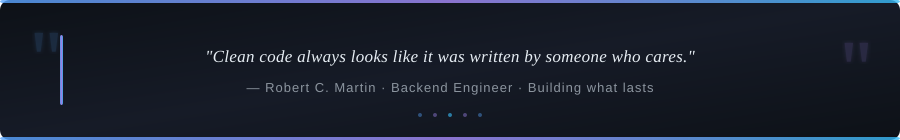

<!-- SELF-HOSTED BANNER — no external service, always works -->
<div align="center">
  
</div>

<!-- TYPING ANIMATION -->
<div align="center">
  
</div>

<br/>

<!-- SOCIAL BADGES -->
<div align="center">
  <a href="https://ritnesh-portfolio.vercel.app">
    
  </a>&nbsp;
  <a href="https://www.linkedin.com/in/ritneshks/">
    
  </a>&nbsp;
  <a href="https://leetcode.com/u/Ritnesh123x">
    
  </a>&nbsp;
  <a href="mailto:ritneshntv@gmail.com">
    
  </a>&nbsp;
  <a href="https://careerpilot-frontend-lc3e.onrender.com">
    
  </a>
</div>

<br/>

<div align="center">
  
  
</div>

---

## 👨‍💻 About Me

```json
{
  "name"       : "Ritnesh Srivastava",
  "role"       : "Backend Software Engineer",
  "portfolio"  : "https://ritnesh-portfolio.vercel.app",
  "company"    : "Ex-Intern @ Catination Ventures",
  "education"  : "B.E. CS&E @ Chandigarh University  |  CGPA: 7.54",
  "location"   : "Chandigarh, India",
  "contact"    : "ritneshntv@gmail.com",
  "philosophy" : "Zero hardcoded secrets. Clean architecture. Always.",
  "status"     : "Open to Backend / Spring Boot / AI Engineering Roles"
}
```

- 🌐 **Personal Portfolio**: [ritnesh-portfolio.vercel.app](https://ritnesh-portfolio.vercel.app) — Modern React + Vite showcase with Video Reel, Spring AI projects & interactive contact form
- 🚀 **Built & deployed** [CareerPilot](https://careerpilot-frontend-lc3e.onrender.com) — production Spring Boot + Spring AI platform on Render
- ⚡ Engineered **DB-backed AI caching** that eliminates 100% of redundant OpenAI API calls
- 🔐 Built production **JWT auth** + BCrypt + Brevo HTTP OTP from scratch
- 🧠 Solved **100+ LeetCode problems** (DSA, graphs, DP, sliding window)

---

## 🛠️ Tech Stack

<div align="center">

**Languages & Core**


**Backend Frameworks**


**Databases & DevOps**


**AI & Other Tools**


</div>

<br/>

<div align="center">


</div>

---

## 🚀 Featured Projects

### ✈️ CareerPilot — AI Career Preparation Platform

> **[🌐 Live Demo](https://careerpilot-frontend-lc3e.onrender.com)** &nbsp;·&nbsp; **[📜 Swagger API Docs](https://careerpilot-backend-3o7v.onrender.com/swagger-ui/index.html)** &nbsp;·&nbsp; **[💻 Source Code](https://github.com/RitneshSrivastava/careerpilot)**

| Feature | What was built |
|---|---|
| **AI Resume Analysis** | Spring AI + OpenAI with **typed structured JSON output** — no regex |
| **PDF Processing** | Apache PDFBox multi-page text extraction pipeline |
| **Smart Caching** | DB-backed result cache → **0% redundant AI API calls** on re-uploads |
| **Authentication** | JWT stateless auth + BCrypt + Brevo HTTP OTP (6-digit, 10 min TTL) |
| **Job Matching** | Deterministic skill-intersection algo with ranked explainable scores |
| **Deployment** | Dockerized backend on Render with managed PostgreSQL |


---

### 🏢 Employee Management System — Enterprise REST API

> **[💻 Source Code](https://github.com/RitneshSrivastava/employee_management_system_with_restfulapi)**

| Feature | What was built |
|---|---|
| **REST API** | Clean MVC with full CRUD — proper request/response design |
| **Persistence** | Spring Data JPA + Hibernate ORM + MySQL |
| **Data Access** | JDBC with optimized query patterns & Java Collections |
| **Design** | SOLID principles, layered architecture, testable code |


---

## 💼 Work Experience

**Backend Engineer Intern** &nbsp;·&nbsp; *Catination Ventures* &nbsp;·&nbsp; `Apr 2025 – Jun 2025`

- Delivered production features in a live, active codebase alongside frontend & backend teams
- Diagnosed and resolved functional & integration bugs across core backend modules
- Enforced clean-code standards through rigorous GitHub code reviews

---

## 📊 GitHub Stats

<div align="center">

<!-- These shields.io badges are served via GitHub's own CDN — always load -->


<br/>


&nbsp;

&nbsp;


<br/><br/>

<!-- Activity Graph — more reliable than stats cards -->


</div>

---

## 🐍 Contribution Snake

<div align="center">
  <picture>
    <source media="(prefers-color-scheme: dark)"  srcset="https://raw.githubusercontent.com/RitneshSrivastava/RitneshSrivastava/output/github-contribution-grid-snake-dark.svg" />
    <source media="(prefers-color-scheme: light)" srcset="https://raw.githubusercontent.com/RitneshSrivastava/RitneshSrivastava/output/github-contribution-grid-snake.svg" />
    
  </picture>
</div>

---

## 🎯 Currently Exploring

```yaml
learning:
  - Redis  (Distributed Caching & Session Management)
  - Kafka  (Event-Driven Microservices)
  - Spring Cloud  (Microservice Orchestration)

building:
  - Enterprise-grade Spring Boot microservice systems
  - Production AI pipelines with vector databases

open_to:
  - Backend Engineering Roles  (Java / Spring Boot)
  - Software Engineering Internships
  - Full-time SWE opportunities
```

---

## 📜 Certifications

| Certificate | Issuer |
|---|---|
| Spring Boot 3, Spring 6 & Hibernate | Udemy |
| Core Java & OOP Fundamentals | Udemy |
| Relational Databases (RDBMS) & MySQL | Coursera |
| Git & Collaborative Workflows | GitHub / Coursera |
| **100+ LeetCode Problems** | [Ritnesh123x](https://leetcode.com/u/Ritnesh123x) |

---

<!-- QUOTE BANNER -->
<div align="center">
  
</div>

<br/>

<div align="center">
  <i>⭐ Star my repos if you find them useful! ⭐</i>
  <br/><br/>
  
  
</div>
